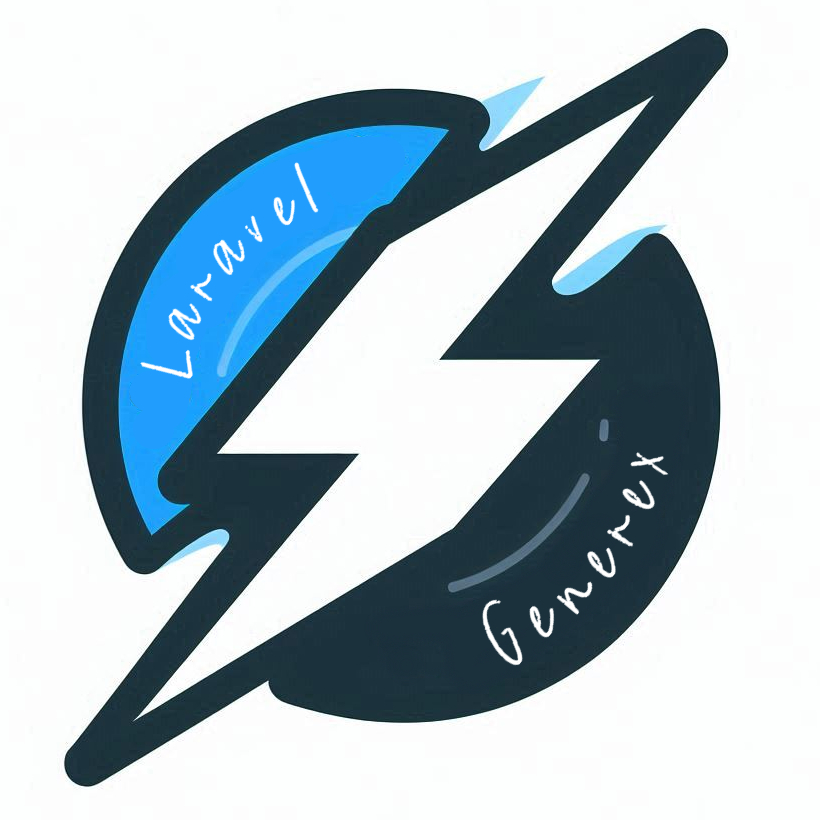

# Laravel Generex 

Customizable Laravel Code Generator with templates.

### ✨ Features 

- Generating packages with CRUD from a ready DB table or a schema file.
- Everything is customizable.
- Support for plain stub & blade engine
- Templates are yours, No forced structure.

### 🔻 Installation

    composer require yassinedabbous/laravel-generex
    
### 🧑‍💻  Usage
Artisan command:

    php artisan gen:pack {TableName}

- If you didn't define a table name you will be asked you to choose one from the list.

- Full command options:

        php artisan gen:pack {TableName} --vendor={YourName} --package={PackageName} --connection={mysql}

### ⚙️ Configuration

- Publish configuration:

        php artisan vendor:publish --tag=generex-config

- Publish templates:

        php artisan vendor:publish --tag=generex-templates
